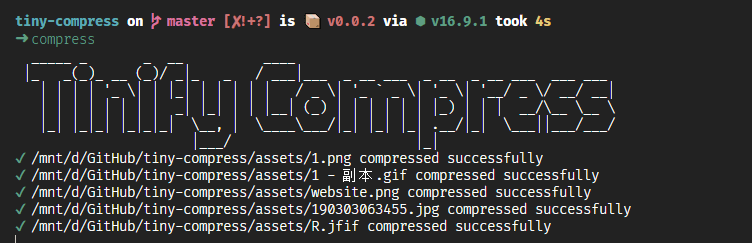

<span><div align="center"></div></span>

## 介绍
- 依赖[tinify](https://tinypng.com/)提供的api实现一个简单的压缩工具
- gif图片的实现来源于[imagemin-gifsicle](https://github.com/imagemin/imagemin-gifsicle)
- 压缩过的图片会被自动跳过，不会重复压缩
- 下面有申请key的链接,免费提供一个我自己的key：DZkjgp25tVjhkLG8GXk0nF3tpNSkq7kX

## 安装
```shell
npm i -g tiny-tinify-compress
```

## 配置
```shell
# package.json 配置你自己key, 申请地址 https://tinypng.com/developers
# includes: "压缩目录下的图片" 只支持 'image/webp', 'image/jpeg', 'image/png', 'image/jpg', 'image/jfif', 'image/gif'
{
  "tinifyCompress": {
    "key": "your-key",
    "includes": [
      "./assets/**"
    ]
  }
}
```

## 使用
```shell
## 如果配置了key，否则第一次会提示你输入key
  compress
## 可以指定需要压缩的目录
  compress ./assets ./public/images
```


